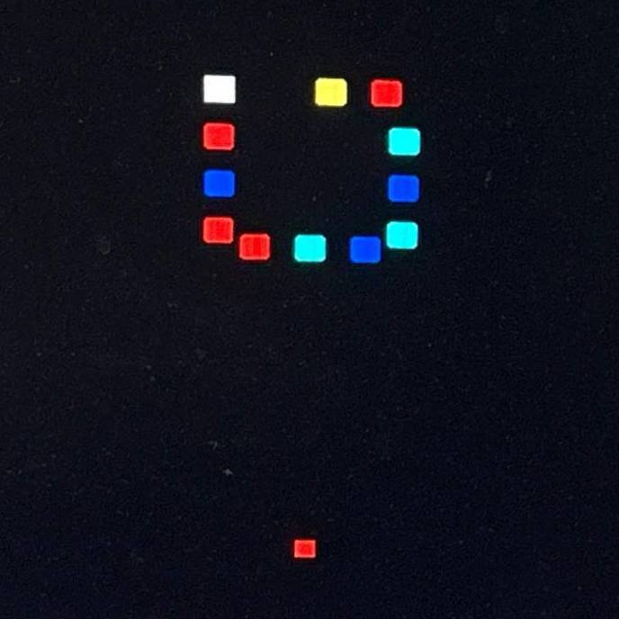
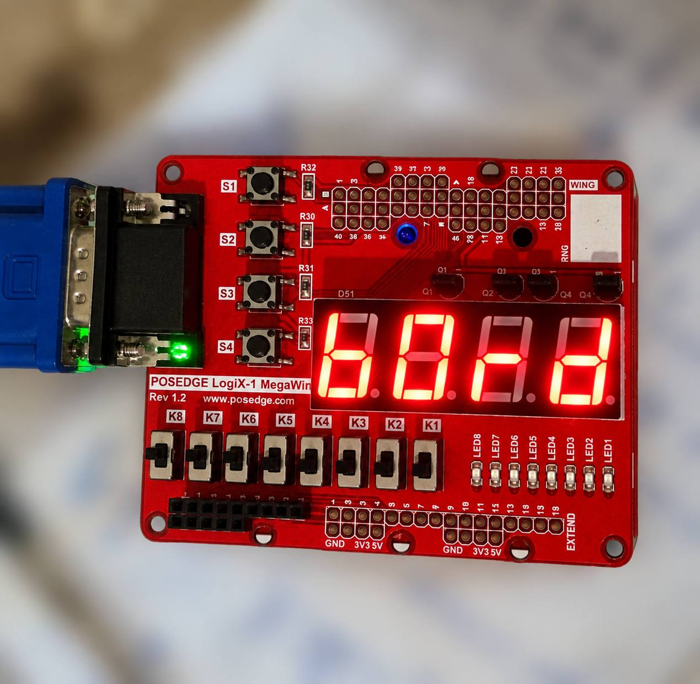
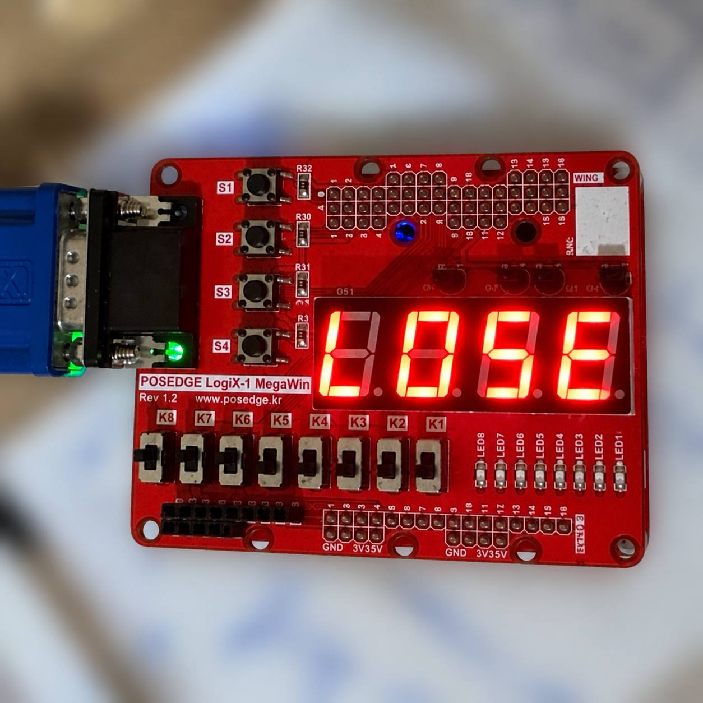

<div align="center">

# 🦋 Butterfly Effect

### A VGA-Based Arcade Game Implemented on Spartan-6 FPGA

<br>


**Digital Systems CAD Project**

</div>

---

## 📑 Table of Contents

- [Overview](#overview)
- [Features](#features)
- [Game Mechanics](#game-mechanics)
- [Hardware Architecture](#hardware-architecture)
- [Gameplay Demo](#gameplay-demo)
- [Hardware Results](#hardware-results)
- [Project Structure](#project-structure)
- [Hardware and Software](#hardware-and-software)
- [Controls](#controls)
- [Implementation](#implementation)

---

<a id="overview"></a>
## 📖 Overview

**Butterfly Effect** is a hardware-based arcade game developed using **VHDL**, implemented on a **Xilinx Spartan-6 FPGA**, and designed using **Xilinx ISE**.

The project demonstrates the implementation of an interactive game using digital hardware, combining VGA graphics generation, real-time game logic, collision detection, and user input processing.

The player controls a shooter that launches colored balls toward a moving chain. The objective is to match colors, eliminate balls, and prevent the chain from reaching the end of its path.

The game features special shooting abilities, a reward system, and dedicated win and lose states.

---

<a id="features"></a>
## ✨ Features

- **VGA Graphics:** 640×480 resolution with 6-bit RGB color output.
- **FPGA Implementation:** Hardware-based game logic implemented using VHDL.
- **Interactive Controls:** Push-button controls for aiming and shooting.
- **Moving Ball Chain:** Colored balls move along a predefined path.
- **Collision Detection:** Detects collisions between fired balls and the moving chain.
- **Color Matching:** Eliminates groups of matching colored balls.
- **Special Abilities:** Additional shooting modes with different elimination effects.
- **Reward System:** Unlocks special abilities based on the number of eliminated balls.
- **Game State Management:** Dedicated playing, winning, and losing states.
- **Seven-Segment Display:** Displays game status using a four-digit seven-segment display.

---

<a id="game-mechanics"></a>
## 🎮 Game Mechanics

### 1. Ball Generation and Movement

Colored balls are generated using a pseudo-random color selection mechanism based on a Linear Feedback Shift Register (LFSR).

The balls move along a predefined path represented by coordinate lookup tables.

The game supports a maximum of 12 balls in its moving chain.

### 2. Shooting System

The player controls a shooter positioned near the bottom of the screen.

Three shooting directions are supported:

- Diagonal left
- Straight ahead
- Diagonal right

A dedicated push button launches the selected ball toward the moving chain.

### 3. Collision Detection and Color Matching

The game continuously checks for collisions between fired balls and the moving chain.

When a normal shot collides with the chain, the game processes ball insertion and checks neighboring colors.

Matching groups of at least three balls are eligible for elimination.

### 4. Special Shooting Abilities

The game includes three shooting modes:

| Mode | Description |
|---|---|
| Normal | Fires a colored ball for color matching |
| Bomb 1 | Removes the target ball and its immediate neighbors |
| Bomb 3 | Removes up to three balls preceding the target |

Special abilities are awarded according to the number of eliminated balls.

### 5. Winning and Losing

The game implements three states:

- **PLAYING:** The player controls the shooter and eliminates balls.
- **WIN:** Triggered when the elimination counter reaches the winning threshold of 8.
- **LOSE:** Triggered when the leading ball reaches the end of the path.

The corresponding game status is displayed using the seven-segment display.

---

<a id="hardware-architecture"></a>
## 🏗️ Hardware Architecture

The project is organized into two main VHDL modules.

### 1. TopLevel.vhd

The main module implements the game logic and integrates the VGA controller.

Its responsibilities include:

- Processing push-button inputs
- Managing shooter direction and ball movement
- Generating pseudo-random ball colors
- Detecting collisions
- Processing ball insertion and elimination
- Managing special shooting abilities
- Controlling game states
- Generating graphics and seven-segment outputs

### 2. VGA_controller.vhd

The VGA controller generates the synchronization signals and visible pixel coordinates required for VGA output.

**VGA Configuration:**

| Parameter | Value |
|---|---|
| Display Resolution | 640 × 480 |
| Input Clock | 24 MHz |
| Horizontal Total | 800 pixels |
| Vertical Total | 525 lines |
| Horizontal Sync Width | 96 |
| Vertical Sync Width | 2 |
| Color Depth | 6-bit RGB |

The controller generates horizontal and vertical synchronization signals and controls RGB output during the visible display region.

---
<a id="gameplay-demo"></a>
## 🎥 Gameplay Demo

The following animation demonstrates the gameplay of Butterfly Effect.

<div align="center">


</div>

---

<a id="hardware-results"></a>
## 📸 Hardware Results

The following images show the game and its output states.

### Gameplay

<div align="center">



</div>

### Winning State

<div align="center">



</div>

### Losing State

<div align="center">



</div>

---

<a id="project-structure"></a>
## 📂 Project Structure

```text
Butterfly-Effect-FPGA/
│
├── TopLevel.vhd
├── VGA_controller.vhd
│
├── images/
│   ├── gameplay.jpg
│   ├── gameplay.gif
│   ├── win.jpg
│   └── lose.jpg
│
├── videos/
│
└── README.md
```

**File Descriptions**

| File | Description |
|---|---|
| TopLevel.vhd | Main game logic and top-level integration |
| VGA_controller.vhd | VGA timing and RGB output generation |
| images/ | Gameplay and hardware screenshots |
| videos/ | Gameplay demonstration videos |
| README.md | Project documentation |

---

<a id="hardware-and-software"></a>
## 🛠️ Hardware and Software

| Component | Specification |
|---|---|
| Hardware Platform | Xilinx Spartan-6 FPGA |
| Development Environment | Xilinx ISE |
| Hardware Description Language | VHDL |
| Display Interface | VGA |
| Display Resolution | 640 × 480 |
| Clock Input | 24 MHz |
| User Input | Push Buttons |
| Additional Output | Four-Digit Seven-Segment Display |

---

<a id="controls"></a>
## 🕹️ Controls

The game uses four active-low push buttons.

| Button | Function |
|---|---|
| PB(0) | Fire |
| PB(1) | Aim diagonally left |
| PB(2) | Aim diagonally right |
| PB(3) | Aim straight ahead |

The shooting direction is selected using the corresponding push button, while the fire button launches a ball.

---

<a id="implementation"></a>
## ⚙️ Implementation

The project was developed using **Xilinx ISE** and implemented in VHDL for the **Xilinx Spartan-6 FPGA**.

The implementation consists of the following main stages:

1. VGA synchronization and pixel coordinate generation.
2. Game graphics rendering.
3. Ball generation and movement control.
4. Shooter control and projectile movement.
5. Collision detection and color-matching logic.
6. Special shooting abilities and reward management.
7. Game state management and seven-segment output.

The design uses a 24 MHz clock input for the VGA controller and game logic.

**Note:** The implemented VGA timing uses 800 horizontal clock periods and 525 vertical lines per frame. With a 24 MHz input clock, the resulting refresh rate is approximately 57.14 Hz.

---

<div align="center">

**🦋 Butterfly Effect**

*Digital Systems CAD — VHDL & FPGA Project*

</div>
